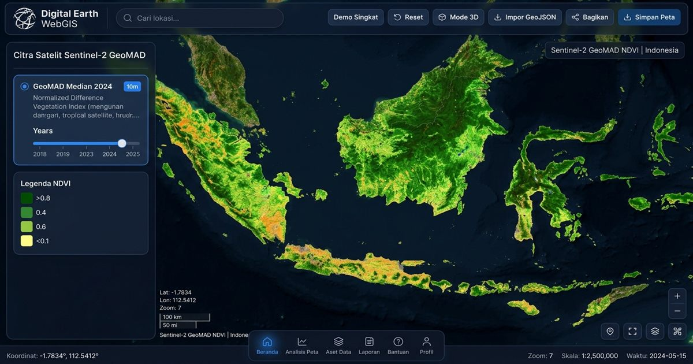
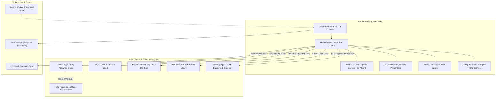

# Digital Earth Indonesia WebGIS

An interactive WebGIS platform for exploring Indonesian Earth Observation datasets and spatial analytics workflows. Integrates BIG Piksel OGC Web Map Services (WMS), Google Earth Engine (GEE) Jabodetabek case study datasets, 3D terrain and building extrusions, client-side pixel sampling, and geodesic spatial calculations.

> **Disclaimer**: Aplikasi peraga independen (*independent demonstration prototype*). Dikembangkan secara mandiri oleh [chipslova](https://github.com/chipslova) dan bukan merupakan aplikasi resmi dari Badan Informasi Geospasial (BIG) maupun Geoscience Australia (GA).

[](https://webgis-three-iota.vercel.app/)
[](https://github.com/chipslova/webgis/actions)
[](https://www.typescriptlang.org/)
[](https://maplibre.org/)
[](https://vitejs.dev/)
[](https://bun.sh/)
[](https://vitest.dev/)

<p align="center">
  
</p>

---

## 🌟 Ringkasan Platform / Overview

**Digital Earth Indonesia WebGIS** adalah platform pemetaan berbasis web modern yang dirancang untuk eksplorasi data Penginderaan Jauh (*Earth Observation*), pemodelan iklim/termal, dan analisis geospasial di wilayah Indonesia.

Aplikasi menghubungkan langsung layanan data resmi OGC WMS BIG Piksel, komposit termal NASA GIBS / MODIS LST, sampling piksel *client-side* Sentinel-2 10m, mesh elevasi 3D Terrarium, serta ekstrusi bangunan 3D dengan antarmuka bilingual yang rapi dan konsisten (Bahasa Indonesia standar untuk UI & terminologi standar internasional untuk format geospasial).

```
┌─────────────────────────────────────────────────────────────────────────────────────────────────────────┐
│                                       Digital Earth WebGIS Application                                   │
│  [🔍 Cari Lokasi...]       [🚀 Demo Singkat] [↺ Reset] [🌐 Mode 3D] [⬆ Impor GeoJSON] [🔗 Bagikan] [📷 Simpan] │
├───────────────┬─────────────────────────────────────────────────────────────────────────────────────────┤
│ BILAH SAMPING │                                  MAPLIBRE GL CANVAS                                     │
│ ───────────── │                                                                                         │
│ 🗺️ Lapisan    │  🛰️  Sentinel-2 GeoMAD 10m Mosaics & Spectral Indices (BIG Piksel OGC WMS)              │
│ 🛰️ Satelit    │  🌡️  MODIS Land Surface Temp Thermal Gradient & Urban Heat Island Analysis              │
│ 🌍 GEE Live   │  ⛰️  3D Terrarium Elevation Mesh & 3D Building Vector Extrusions (WebGL2)               │
│ 📈 Analisis   │  📍  Interactive Geodesic Distance & Area Geometries (Turf.js)                          │
│ 📏 Ukur       │                                                                                         │
│ 📁 Data Hub   │  ┌───────────────────────────────────────────────────────────────────────────────────┐  │
│ 📋 Legenda    │  │ 🧭 DOCK: [🗺️ 16 Peta Dasar] [🎛️ Sublapisan] [🪟 Bandingkan] [📷 Ekspor Peta]         │  │
│ ℹ️ Tentang    │  └───────────────────────────────────────────────────────────────────────────────────┘  │
└───────────────┴─────────────────────────────────────────────────────────────────────────────────────────┘
```

---

## 🚀 Fitur Unggulan (8 Modul Analisis Geospasial)

### 🗺️ 1. Lapisan & Peta Dasar (Basemap & Hierarchy Manager)
* **16 Pilihan Peta Dasar Vektor & Raster**:
  * ⭐ **Rekomendasi:** Esri World Imagery (Bawaan), Esri World Streets, Rupabumi Indonesia (BIG RBI), OpenStreetMap Standard.
  * 🎨 **Topografi & Tematik:** Esri Topographic, OpenTopoMap, Esri Shaded Relief, Esri National Geographic, Esri Ocean.
  * 🌓 **Kanvas & Minimalis:** Esri Light/Dark Gray Canvas, OpenFreeMap Liberty (Vektor), OpenFreeMap Positron (Vektor), Esri Imagery Clarity, OSM Humanitarian, Esri Colored Pencil.
* **Manajer Hirarki Tumpukan Lapisan (Layer Stack)**: Pengaturan opasitas dinamis (0–100%), visibilitas layer, dan penyusunan urutan tumpukan (*stack order*) secara deterministik.
* **Sublapisan Vektor Granular**: Kontrol aktif/nonaktif jalan, label jalan, nama tempat (*place labels*), batas administratif, tutupan lahan (*landcover*), perairan, dan poligon bangunan.

### 🛰️ 2. Citra Satelit BIG Piksel & Filter Spektral
* **Sentinel-2 GeoMAD 10m**: Komposit tahunan bebas awan Median Absolute Deviation (2017–2025) di seluruh kepulauan Indonesia.
* **Indeks Spektral Satelit (OGC WMS)**:
  * **NDVI** (Normalized Difference Vegetation Index)
  * **NDWI** (Normalized Difference Water Index)
  * **NIR Surface Reflectance** (Pantulan Inframerah Dekat)
  * **Kerapatan Pengamatan** (*Observation Density*)
* **Penyesuaian Filter Visual Real-Time**: Kontrol non-destruktif *Brightness* (kecerahan), *Contrast* (kontras), dan *Saturation* (kejenuhan warna) langsung pada kanvas WebGL.
* **Landsat 9 Surface Reflectance (30m)**: Komposit multispektral USGS/NASA (2022–2025).
* **Pemodelan Bahaya Banjir (Flood Hazard)**: Klasifikasi periode ulang banjir (`flood_hazard_rp02` & `rp10`) untuk wilayah studi prioritas.
* **Grid Indeks Open Data Cube (ODC)**: Hamparan interaktif 1.631 batas ubin (*tile boundaries*) ODC di seluruh Indonesia.

### 🌍 3. GEE Live & Sampling Piksel Satelit Gratis
* **Sampling Piksel Client-Side (Tanpa Setup Akun)**: Langsung mengekstraksi nilai piksel dari ubin citra Sentinel-2 10m & cuaca real-time Open-Meteo tanpa memerlukan akun berbayar atau konfigurasi server.
* **Integrasi Google Earth Engine Asli (Opsional)**: Panduan 3-langkah transparan untuk menghubungkan Service Account Google Cloud / GEE resmi via env var Vercel (`GEE_CLIENT_EMAIL` & `GEE_PRIVATE_KEY`).
* **NASA MODIS Land Surface Temp (LST 1 km)**: Ubin gradien termal suhu permukaan bumi kontinu ($10^\circ\text{C} \to 42^\circ\text{C}+$) via NASA GIBS WMS dengan *ocean masking* transparan.
* **18 Titik Pengamatan Referensi LST**: Titik tervalidasi MODIS *clear-sky QA bitmask* dengan kalkulasi anomali suhu siang/malam (*diurnal delta*).
* **Tutupan Lahan & Elevasi SRTM**: Sentinel-2 10m LULC (9 kelas) dan kontur elevasi USGS SRTM 30m.

### 📈 4. Analisis Geospasial & Grafik Waktu-Nyata
* **Grafik Runtun Waktu Musiman (Harmonic Time-Series)**: Visualisasi kurva suhu permukaan LST vs simulasi suhu udara 2m NOAA CFSv2 dengan tabel data yang ramah aksesibilitas (*screen-reader friendly*).
* **Analisis Gradien Termal Urban Heat Island (UHI)**: Perbandingan anomali suhu antara dataran rendah metropolitan (mis. Jakarta 34.8°C) dan dataran tinggi (mis. Bandung 21.2°C).
* **Profil Elevasi Medan Geodesik**: Pengambilan profil penampang lintang topografi sepanjang rute garis yang digambar pengguna.

### 📏 5. Pengukuran Geodesik, Buffer & Mode 3D
* **Pengukuran Jarak & Luas Geodesik (Turf.js)**: Perhitungan akurat kelengkungan bumi dengan fitur pembatalan titik sudut (*vertex undo* via <kbd>Z</kbd>), penyelesaian rute, dan tooltip pengukuran dinamis.
* **Analisis Jangkauan Buffer Geodesik**: Pembuatan poligon *buffer* di sekitar titik, garis, dan area dengan kalkulasi total luas poligon ($km^2$) serta pemilihan warna (*color picker*).
* **Elevasi Medan 3D AWS Terrarium**: Rekonstruksi medan 3D secara *real-time* dengan kontrol perbesaran vertikal (*vertical exaggeration* 0.1x – 3.0x).
* **Ekstrusi Bangunan 3D OpenFreeMap**: Render 3D poligon bangunan planet secara dinamis dengan transisi kamera halus.

### 📁 6. Hub Data Geospasial & Tabel Atribut
* **Impor Multi-Format**: Drag-and-drop atau pilih berkas `.geojson`, `.json`, `.kml`, `.csv`, `.tsv`, dan `.txt` dengan deteksi otomatis kolom koordinat (Latitude/Longitude).
* **Ekspor Vektor**: Unduh data spasial yang telah diolah ke format `.geojson` maupun format `.kml` yang telah disanitisasi XML.
* **Panel Tabel Atribut Spasial**: Inspeksi data tabular interaktif dengan pencarian teks real-time, penyorotan fitur (*feature highlighting*), dan sanitasi karakter HTML yang aman dari serangan XSS.

### 🪟 7. Alat Pembanding Citra (Swipe Compare) & Ekspor Kartografis
* **Tirai Pembanding Interaktif (Swipe Compare)**: Membelah layar peta untuk membandingkan dua dataset satelit secara berdampingan dengan slider bergerak halus (mis. True Color vs NDVI Bromo, Citra Satelit vs Peta Jalan, atau Sentinel-2 2017 vs 2025).
* **Ekspor Peta Kartografis Siap Cetak**:
  * Pilihan rasio aspek: **16:9** (Widescreen), **4:3** (Standar), **A4** (Landscape), **1:1** (Persegi).
  * Pilihan resolusi: **1x** (Standar Web) & **2x** (Ultra HD / Cetak).
  * Format ekspor: **PNG** & **JPEG**.
  * Elemen kartografi opsional: **North Arrow (Arah Utara Dinamis)**, **Skala Geodesik Metrik**, **Legenda Terintegrasi**, **Koordinat WGS84**, dan **Atribusi Waktu**.

### ℹ️ 8. Sitasi Ilmiah & Tampilan Tersimpan (Saved Views)
* **Sitasi Akademik Terstandarisasi**: Format sitasi lengkap APA (7th Ed.) dan BibTeX dengan tombol salin 1-klik untuk publikasi atau laporan ilmiah.
* **Tampilan Tersimpan (Saved Views)**: Simpan, beri nama, dan panggil kembali posisi kamera, peta dasar, dan lapisan satelit pilihan secara lokal di browser via `localStorage`.
* **Permalink URL Berstatus Lengkap**: Sinkronisasi otomatis posisi koordinat, zoom, sudut *pitch*, *bearing*, peta dasar, dan produk satelit langsung ke URL *hash*.

---

## 🏗️ Arsitektur Teknis



### Keamanan & Efisiensi Sistem
* **Pertahanan XSS Mendalam (Defense-in-Depth)**: Sanitasi string HTML yang ketat pada seluruh input GeoJSON, nama file, dan popover, diperkuat dengan header HTTP Content-Security-Policy (CSP) di `vercel.json`.
* **Efisiensi Ukuran Berkas**: Dataset GeoJSON statis dimuat secara *lazy-loading* via HTTP asinkron, menjaga ukuran berkas JavaScript inti tetap ramping (~263 KB / ~70 KB gzipped) dengan pemisahan *chunk* modular untuk MapLibre GL, Turf.js, dan PMTiles.
* **Hirarki Tumpukan Lapisan Deterministik**: Fungsi terpusat `enforceLayerOrder()` menjamin visualisasi selalu konsisten pada setiap perpindahan peta dasar:
  $$\text{Pengukuran/Buffer} \to \text{Vektor GeoJSON Kustom} \to \text{Titik Stasiun POI} \to \text{Grid ODC} \to \text{Raster LST GEE} \to \text{WMS Piksel} \to \text{Peta Dasar}$$
* **Aksesibilitas & Pembaca Layar**: Dukungan penuh navigasi keyboard, region `aria-live` untuk pengumuman perubahan status peta, serta atribut ARIA lengkap pada seluruh panel laci dan tab.

---

## 📊 Sumber Data & Provenansi (Data Provenance)

| Dataset | Penyedia / Sumber | Resolusi Spasial | Cakupan Waktu | Protokol Akses |
| :--- | :--- | :--- | :--- | :--- |
| **Sentinel-2 GeoMAD** | BIG Piksel / ESA | 10 meter | 2017 – 2025 | OGC WMS 1.3.0 (PNG / Edge Proxy) |
| **Indeks Spektral (NDVI/NDWI)** | Open Data Cube | 10 meter | Komposit Tahunan | OGC WMS 1.3.0 |
| **Landsat 9 Multispektral** | USGS / NASA | 30 meter | 2022 – 2025 | OGC WMS 1.3.0 |
| **Model Bahaya Banjir** | BIG Hidrologi | 10 meter | Wilayah Studi Prioritas | OGC WMS 1.3.0 |
| **MODIS Land Surface Temp** | NASA LP DAAC (MOD11A2 / MYD11A2) | 1.000 meter (1 km) | 2000 – Sekarang (8-Day) | NASA GIBS WMS & GEE Serverless Compute |
| **Sampling Piksel Satelit** | Sentinel-2 / Open-Meteo | 10 meter | Live Client-Side | Canvas Pixel Extraction & REST API |
| **Stasiun Referensi LST** | MODIS Clear-Sky QA Points | Titik Pengamatan | Baseline Multi-Tahun | GeoJSON (Lazy Fetch) |
| **SRTM Digital Elevation** | USGS / NASA | 30 meter | Grid DEM Statis | GeoJSON (Lazy Fetch) |
| **Sentinel-2 10m LULC** | Impact Observatory / ESRI | 10 meter | Komposit 9 Kelas | GeoJSON (Lazy Fetch) |
| **3D Terrarium DEM** | Mapzen / AWS Open Data | Global DEM | Kontinu | Raster DEM TileJSON |
| **3D Buildings** | OpenFreeMap / OSM | Global Vektor | Kontinu | Vector Tiles |
| **Rupabumi Indonesia (RBI)** | Badan Informasi Geospasial | Vektor | Skala Nasional | TileJSON / Vector |

---

## 💻 Tumpukan Teknologi (Tech Stack)

* **Bahasa**: TypeScript 5.x (Strict Type Checking)
* **Mesin Pemetaan**: [MapLibre GL JS](https://maplibre.org/) (v6.3.0)
* **Kalkulasi Spasial**: [@turf/turf](https://turfjs.org/) (Modular: `@turf/helpers`, `@turf/length`, `@turf/area`, `@turf/buffer`, `@turf/distance`)
* **Protokol Raster / Vektor**: OGC WMS 1.3.0, NASA GIBS WMS, PMTiles, GeoJSON, TileJSON
* **Framework Pengujian**: [Vitest](https://vitest.dev/) (**168 Unit & Integration Tests** di 24 test suites — 100% Lulus)
* **Alat Bangun (Build Tool)**: [Vite 6](https://vitejs.dev/)
* **Package Manager / Runtime**: [Bun](https://bun.sh/)

---

## 🛠️ Panduan Memulai (Getting Started)

### Prasyarat
* [Bun](https://bun.sh/) (v1.1 atau lebih baru) atau Node.js 18+

### Instalasi & Pengembangan Lokal

```bash
# 1. Kloning repositori
git clone https://github.com/chipslova/webgis.git
cd webgis

# 2. Pasang dependensi
bun install

# 3. Jalankan server pengembangan lokal (berjalan di http://localhost:3000)
bun run dev

# 4. Jalankan rangkaian pengujian unit dan integrasi (168 tests)
bun run test

# 5. Pemeriksaan tipe data TypeScript
bun x tsc --noEmit

# 6. Kompilasi paket produksi
bun run build

# 7. Pratinjau paket produksi lokal
bun run preview
```

---

## ⚠️ Batasan & Informasi Teknis

* **Ketersediaan Layanan WMS**: Mosaik citra satelit BIG Piksel diakses via staging OGC WMS (`ows.staging.piksel.big.go.id`) yang disalurkan melalui edge proxy `/api/wms-proxy`. Kecepatan dan uptime bergantung pada infrastruktur server upstream.
* **Batas Zoom Minimum Citra**: Citra resolusi tinggi Sentinel-2 10m dan Landsat 9 30m memerlukan tingkat zoom $Z \ge 8$ (atau $Z \ge 7$ untuk Landsat) agar ubin citra dirender oleh server WMS.
* **Akselerasi Grafis 3D**: Fitur visualisasi medan 3D dan ekstrusi bangunan memerlukan peramban (*browser*) dengan dukungan WebGL2.

---

## 📄 Lisensi & Hak Cipta

Didistribusikan di bawah **Lisensi MIT**. Lihat berkas `LICENSE` untuk rincian lengkap.
Proyek ini dibuat dan dikelola secara independen oleh [chipslova](https://github.com/chipslova).
